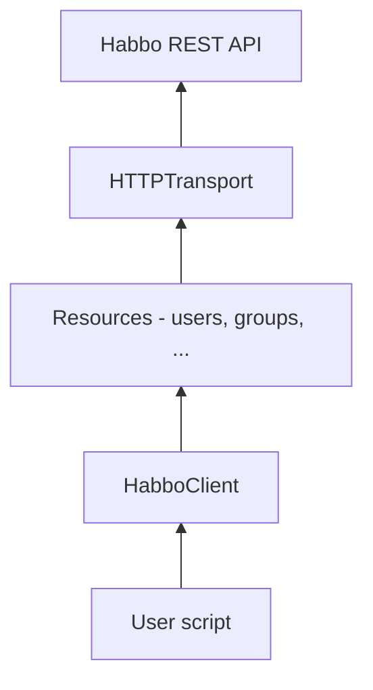

# pyhabbo

Unofficial Python SDK for the [Habbo public Web API](https://www.habbo.com/api/public/api-docs/).

## Requirements

- Python 3.11+
- [uv](https://docs.astral.sh/uv/) (recommended) or pip

## Setup

```bash
git clone https://github.com/0xChron/pyhabbo
cd pyhabbo

# Create venv and install dependencies
uv sync --extra dev

# Install the package in editable mode
uv pip install -e .
```

## Commands

```bash
# Run the test suite
uv run pytest

# Run tests with verbose output
uv run pytest -v

# Lint
uv run ruff check src tests

# Format
uv run ruff format src tests

# Quick manual smoke test against the live API
uv run python -c "from pyhabbo import HabboClient; c = HabboClient(); c.ping(); c.close(); print('ping OK')"
```

## Usage

```python
from pyhabbo import HabboClient, Hotel

with HabboClient(hotel=Hotel.COM) as client:
    client.ping()

    user = client.users.get_by_name("Habbo")
    print(user.name, user.current_level)

    profile = client.users.get_profile(user.unique_id)
    print(len(profile.badges), len(profile.friends))
```

Use a different hotel by passing `hotel=Hotel.DE` (or `.FI`, `.FR`, etc.). You can also pass a custom `base_url` if needed.

### Users API

| Method | Endpoint |
|--------|----------|
| `client.users.get_by_name(name)` | `GET /users?name=` |
| `client.users.get(user_id)` | `GET /users/{id}` |
| `client.users.get_profile(user_id)` | `GET /users/{id}/profile` |
| `client.users.list_friends(user_id)` | `GET /users/{id}/friends` |
| `client.users.list_groups(user_id)` | `GET /users/{id}/groups` |
| `client.users.list_rooms(user_id)` | `GET /users/{id}/rooms` |
| `client.users.list_badges(user_id)` | `GET /users/{id}/badges` |

### Achievements API

| Method | Endpoint |
|--------|----------|
| `client.achievements.list_all()` | `GET /achievements` |
| `client.achievements.list_for_user(user_id)` | `GET /achievements/{user_id}` |

## Architecture

The SDK is organized in layers. Each layer only talks to the one directly below it.



### Project layout

```
pyhabbo/
├── pyproject.toml
├── README.md
├── src/
│   └── pyhabbo/
│       ├── __init__.py       # Public exports
│       ├── client.py         # HabboClient entry point
│       ├── _http.py          # HTTP transport (internal)
│       ├── hotels.py         # Hotel enum + base URLs
│       ├── exceptions.py     # API error types
│       ├── models/           # Pydantic response models (upcoming)
│       └── resources/        # Endpoint groups (upcoming)
└── tests/
    ├── conftest.py
    ├── test_hotels.py
    ├── test_exceptions.py
    └── test_http.py
```

### Modules

| Module | Role |
|--------|------|
| `hotels.py` | Maps each Habbo hotel to its API origin (`https://www.habbo.com`, etc.) |
| `exceptions.py` | `HabboAPIError`, `NotFoundError`, `BadRequestError` |
| `_http.py` | Builds `/api/public` URLs, calls httpx, parses JSON, maps HTTP status to exceptions |
| `client.py` | User-facing client; wires transport and will expose resource namespaces |

### Error handling

Habbo returns errors like:

```json
{
  "errors": [
    {"param": "id", "msg": "user.invalid_id", "value": "invalid-id-xyz"}
  ]
}
```

The transport raises typed exceptions:

```python
from pyhabbo import HabboClient
from pyhabbo.exceptions import NotFoundError

try:
    with HabboClient() as client:
        client.ping()
except NotFoundError as exc:
    print(exc.status_code)   # 404
    print(exc.errors[0].msg) # user.invalid_id
```

## Current status

Implemented:

- Project scaffold (`src/` layout, hatchling build, pytest + respx)
- `Hotel` enum for all major hotels
- Exception hierarchy + error parsing
- `HTTPTransport` and `HabboClient`
- **Users resource** — all 8 `/users` endpoints
- **Achievements resource** — `GET /achievements` and `GET /achievements/{user_id}`

Coming next:

- Groups, rooms, badges, marketplace, lists resources
- Origins endpoints

## API reference

Official docs: [Habbo Web API Swagger UI](https://www.habbo.com/api/public/api-docs/)

## License

MIT - See [LICENSE](LICENSE)
